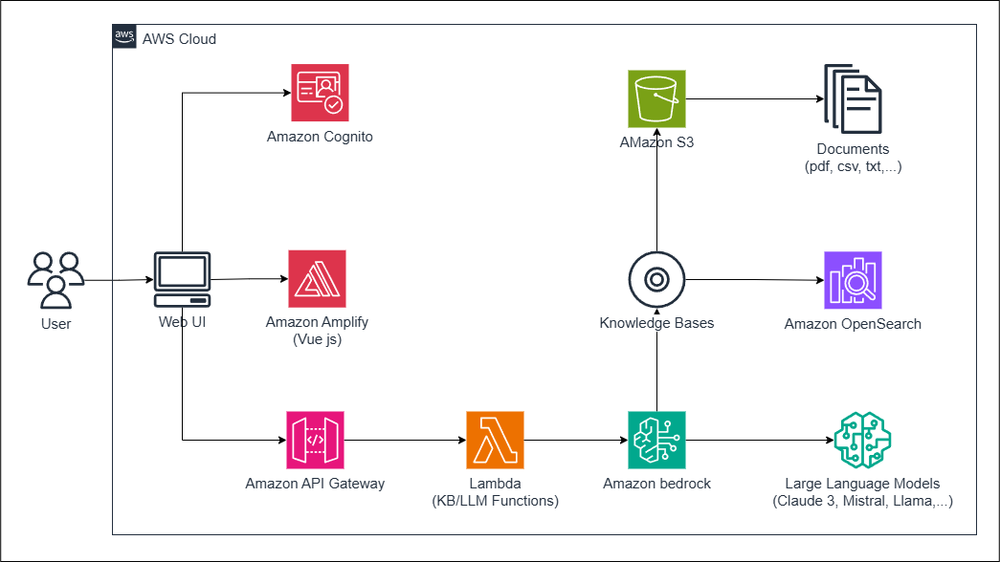

# PERSONALIZED PDF CHATBOTS WITH AMAZON BEDROCK
---
## Solution Architecture

## Components
1. User: End user of the chatbot
2. Web UI: User interface for chatbot interactions
3. AWS Amplify: Manages the UI and authentication, specifically using Vue.js
4. Amazon API Gateway: Handles API requests
5. AWS Lambda (KB/LLM Functions): Executes serverless functions for Retrieval-Augmented Generation, Knowledge Base operations, and LLM interactions
6. Amazon Bedrock: Provides access to AI models and services
7. Large Language Models (Claude 3, Mistral, Llama, etc.): AI models that support responses
8. Knowledge Bases: Stores structured information architecture
9. Amazon S3: Object storage for documents and data
10. Documents (pdf, csv, txt, etc.): Various file types for collection
11. Amazon OpenSearch: Vector database and search engine for efficient similarity searching
12. Amazon Cognito: User authentication and authorization

## Workflow
1. Users interact with the Web UI
2. Requests are routed via API Gateway to Lambda functions
3. Lambda functions use Bedrock to access LLM, and RAG operations, and interact with Knowledge Bases
4. Knowledge is retrieved from Knowledge Bases, S3, OpenSearch
5. The system combines different types of documents to enhance Knowledge Bases

## Key Features
1. Scalable, serverless architecture
2. Leverages multiple LLM models including Claude 3, Mistral, and Llama
3. Combine Custom Knowledge Bases with Personal Data
4. Secure Authentication with Cognito
5. Flexible Document Search and Collection
6. Front-end Built with Modern Frameworks (Vue.js) Using AWS Amplify

## Summary
This architecture allows the AI-powered chatbot solution to scale on demand while providing intelligent responses based on both LLM knowledge and personal data (often confidential corporate or personal data). Using Vue.js with AWS Amplify ensures a responsive and efficient user interface.

## Workshop
🔻Workshop: https://levuxuananit.github.io/AWS-RAG-CHATBOT-WORKSHOP/

---

> Linkedin [Le Vu Xuan An](https://www.linkedin.com/in/levuxuanan/) &nbsp;&middot;&nbsp;
> GitHub [@levuxuananit](https://github.com/levuxuananit) &nbsp;&middot;&nbsp;
> Gmail [levuxuanan.it@gmail.com](https://www.linkedin.com/in/levuxuanan/)
